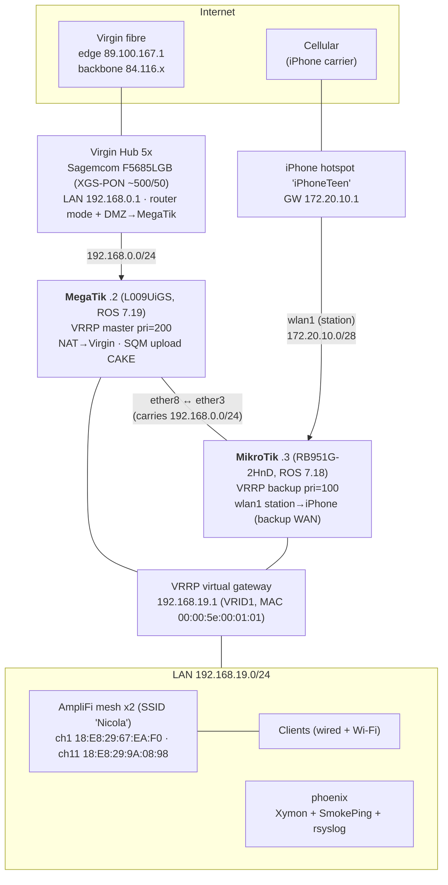

# Home Network — Topology & Failover Runbook

_Last updated: 2026-08-30_

Overview of the home network: dual-router VRRP gateway on Virgin Media Ireland
fibre, with an iPhone cellular tether as a backup WAN on the secondary router.

---

## Topology diagram



---

## Device inventory

| Role | Name | IP | Model / OS | VRRP | Notes |
|------|------|----|-----------|------|-------|
| Primary router | **MegaTik** | 192.168.19.2 | MikroTik L009UiGS, RouterOS 7.19 | master (pri 200) | NAT to Virgin; SQM upload CAKE; Hub DMZ target. PTR: `adsl1-linksys.canne` |
| Backup router | **MikroTik** | 192.168.19.3 | MikroTik RB951G-2HnD, RouterOS 7.18 | backup (pri 100) | iPhone tether backup WAN on `wlan1`. PTR: `fritz.canne` |
| Modem | Virgin Hub 5x | 192.168.0.1 | Sagemcom F5685LGB (XGS-PON) | — | Router mode + DMZ → MegaTik. WAN GW 89.100.167.1 |
| Wi-Fi | AmpliFi mesh (x2) | — | Ubiquiti AmpliFi | — | SSID `Nicola`; ch1 + ch11; bridge mode on LAN |
| Monitoring | phoenix | (LAN) | — | — | Xymon, SmokePing, rsyslog (`/var/log/mikrotik.log`) |
| Backup WAN | iPhone "iPhoneTeen" | 172.20.10.1 | — | — | Cellular hotspot; `.3` `wlan1` station, 172.20.10.0/28 |

---

## WAN paths & routing

- **Primary:** LAN → VRRP GW `.1` (MegaTik) → Virgin Hub `192.168.0.1` → Virgin fibre.
- **`.3`'s view of Virgin:** `.3 ether3` ↔ `.2 ether8` carries the Hub segment `192.168.0.0/24`; `.3` default route is `0.0.0.0/0 via 192.168.0.1` (distance 6). So `.3` reaches Virgin **through** `.2`.
- **Backup (cellular):** `.3 wlan1` (station → iPhone) → `172.20.10.1` → carrier. Default route `0.0.0.0/0 via 172.20.10.1` **distance 8** (standby). NAT via the `srcnat out-interface-list=World masquerade` rule (`wlan1` is in the `World` interface list).

### Route distances on `.3`
| Distance | Path | State |
|---|---|---|
| 6 | `via 192.168.0.1` (Virgin, through `.2`) | active/primary |
| 8 | `via 172.20.10.1` (iPhone tether) | standby/backup |

---

## VRRP

- Virtual gateway **192.168.19.1** — VRID 1 `default_gw` on `bridge`, MAC `00:00:5e:00:01:01`.
- Second instance `nat_dest` (VRID 2, MAC `00:00:5e:00:01:02`), `group-authority=default_gw` (fails over together).
- `sync-connection-tracking=yes` is configured **but not currently working** — see Known Issues. Consequence: failover is **not** seamless; established connections drop on a master change.

---

## Failover procedures

### A. Virgin outage → switch LAN to the iPhone tether (MANUAL)
Run **on `.3` (MikroTik)**, directly (NOT in Safe Mode — it reverts on the disconnect):

```rsc
# Fail over to cellular:
/system script run wan-tether-on
# Restore Virgin:
/system script run wan-tether-off
```

Where the scripts are:
```rsc
/system script add name=wan-tether-on source={
  /interface vrrp set default_gw priority=250
  /ip dhcp-client set [find interface=wlan1] default-route-distance=5
}
/system script add name=wan-tether-off source={
  /interface vrrp set default_gw priority=100
  /ip dhcp-client set [find interface=wlan1] default-route-distance=8
}
```
- `priority=250` makes `.3` VRRP master (LAN clients use `.3`).
- Lowering the tether route to distance 5 makes it win over the Virgin route (distance 6).
- **Manage the tether route via the DHCP client (by `interface=wlan1`), NOT via `/ip route set`** — the DHCP-added default route is **dynamic** (`D` flag) and can't be edited directly. Keying on the interface also means no hotspot-gateway IP is hardcoded (phone-agnostic).
- If the distance change doesn't apply live (some RouterOS versions apply it only on renewal), force it: `/ip dhcp-client renew [find interface=wlan1]`. Verify with `/ip route print`.
- ⚠️ Expect a brief drop of existing connections at the switch (CTSYNC not working).

> Alternative (instantly script-editable, but hardcodes the gateway): set `add-default-route=no` on the DHCP client and add a **static** default `route add dst-address=0.0.0.0/0 gateway=172.20.10.1 distance=8 comment=tether`; then scripts edit it with `/ip route set [find comment=tether] distance=5`. `172.20.10.1` is stable for iPhone hotspots (iOS `172.20.10.0/28`), but would change for a non-Apple tether.

### B. Verify the tether before/after
```rsc
/interface wireless registration-table print          # wlan1 associated to iPhone?
/ip address print where interface=wlan1                # 172.20.10.x lease present?
/ip route add dst-address=8.8.8.8/32 gateway=172.20.10.1
/ping 8.8.8.8                                          # should reply ~15-20 ms
/ip route remove [find dst-address=8.8.8.8/32]
```
Note: iPhone hotspot sleeps without active clients — sustained traffic wakes it.

### C. `.2` (MegaTik) hardware failure
- VRRP auto-promotes `.3` to master (no adverts from `.2`).
- `.3` loses the Virgin path (`ether3` dead-ends at `.2`), so use the **tether** (procedure A) or physically move `.3`'s `ether3` cable to a spare port on the Virgin Hub for an independent Virgin uplink.

### D. Force VRRP master manually (either router)
```rsc
# make .3 master:
/interface vrrp set default_gw priority=250     # on .3
# hand back to .2:
/interface vrrp set default_gw priority=100     # on .3
```

---

## SQM / bufferbloat (MegaTik)

- **Stable baseline:** upload-only CAKE — simple queue `SQM` target `192.168.19.0/24`, `queue=cake-up/default`, upload shaped ~45M by `cake-up`; FastTrack **disabled** (required for queues + conntrack-sync).
- Download CAKE (`cake-down`) was tested but is **not** used (destabilised interactive traffic; download loss is Virgin-side, not local saturation).
- FastTrack toggle can be used as an on/off switch for shaping (FastTrack on = queues bypassed).

---

## Known issues

1. **Virgin-side packet loss (open fault):** ~2.3% loss to multiple backbones simultaneously (overnight), while the Hub (`192.168.0.1`) shows 0% loss and local WAN utilisation is low → fault is in Virgin's network, not local equipment. Fault report filed with Virgin Media Ireland (evidence: SmokePing Hub-vs-Internet graphs + WAN throughput). Escalation: ComReg (`consumerline@comreg.ie`) after 10 working days.
2. **VRRP conntrack-sync inactive on `.3`:** `sync-connection-tracking=yes` on both, conntrack active on both, path open (verified by sniffer — master emits no CTSYNC stream), `remote-address` set both sides — yet `.3` reports "Connection tracking inactive!". By elimination the cause is the **RouterOS version mismatch** (`.2` 7.19 vs `.3` 7.18) / RB951 platform. Fix: align `.3` to 7.19. Impact: failover not seamless (sessions drop on master change).

---

## Monitoring

- **Xymon** (phoenix): host/service up-down, WAN throughput via devmon (patched — RouterOS getbulk probe lowered from max-rep 1000 → 25 in `dm_snmp.pm`), speedtest feed.
- **SmokePing**: latency/loss to Virgin Hub, Virgin edge, backbone, and Internet resolvers (Google/Cloudflare/Quad9/OpenDNS/Level3) + an HTTPS/TCP probe. URL: https://spg.nicolacanepa.net/smokeping/
- **netwatch → rsyslog**: `.2`/`.3` netwatch events (WAN/HUB/VIRGIN-EDGE up/down) shipped to phoenix `/var/log/mikrotik.log` (filed per source IP `.1`/`.2`/`.3`).

---

## Key addresses & reference

| Item | Value |
|---|---|
| LAN subnet | 192.168.19.0/24 |
| VRRP gateway | 192.168.19.1 |
| MegaTik / MikroTik | 192.168.19.2 / .3 |
| Virgin Hub (LAN / WAN GW) | 192.168.0.1 / 89.100.167.1 |
| iPhone tether (subnet / GW) | 172.20.10.0/28 / 172.20.10.1 |
| SmokePing | https://spg.nicolacanepa.net/smokeping/ |
| Virgin IE complaints | Freephone 1908 · virginmedia.ie/contact-information · post: Complaints Team, Limerick Enterprise Development Park, Roxboro Road, Limerick |

---

## Diagram source

- Editable diagram: [`home_network_topology.drawio`](./home_network_topology.drawio) (open with diagrams.net / the Draw.io VS Code / Zed extension).
- The Mermaid graph above is the quick-view version kept in sync with the `.drawio`.

---

## Change log

| Date | Change |
|------|--------|
| 2026-08-30 | Initial topology + failover runbook. Documented VRRP pair (MegaTik .2 master / MikroTik .3 backup), Virgin Hub 5x, AmpliFi mesh, and monitoring stack. |
| 2026-08-30 | Added iPhone "iPhoneTeen" tether as backup WAN on `.3 wlan1`: DHCP client on `wlan1`, NAT via `World` list masquerade, standby default route (distance 8). Verified: pings `8.8.8.8` ~15–20 ms via cellular. |
| 2026-08-30 | Added `wan-tether-on` / `wan-tether-off` manual failover scripts (VRRP priority 250 + tether route distance 5). |
| 2026-08-30 | Reverted download CAKE experiment; confirmed **upload-only** CAKE as the stable SQM baseline (FastTrack disabled). |
| 2026-08-30 | Patched devmon on phoenix: lowered the getbulk capability-probe from max-rep 1000 → 25 in `dm_snmp.pm` (RouterOS returned `tooBig` and fell back to slow getnext). MegaTik now polls via getbulk. |
| 2026-08-30 | Corrected failover scripts: manage the tether route via `/ip dhcp-client set [find interface=wlan1] default-route-distance=...` (the DHCP default route is dynamic and can't be `/ip route set`); avoids hardcoding the hotspot gateway IP. |

### Open items / TODO
- [ ] **Virgin fault:** await response to filed packet-loss complaint; escalate to ComReg if unresolved in 10 working days.
- [ ] **Upgrade `.3` (MikroTik) RouterOS 7.18 → 7.19** to fix VRRP `sync-connection-tracking` (currently "inactive" — version mismatch). Until then, failover drops established sessions.
- [ ] Decide manual vs automatic tether failover (recursive `check-gateway` pinging beyond the Hub for auto).
- [ ] Optional: give `.3` an independent Virgin uplink (move `ether3` cable to a spare Hub port) so it survives a `.2` hardware failure without relying on the tether.
- [ ] Tidy stale/disabled default routes on `.3` (leftover `192.168.1.x`, `*A`, `*17`).
